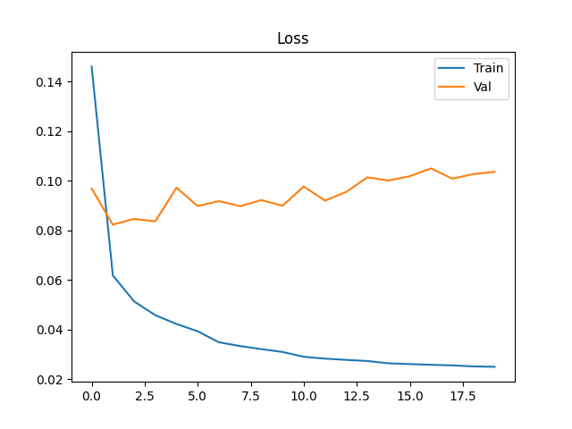
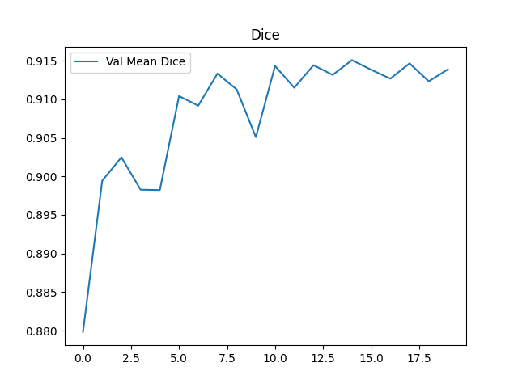
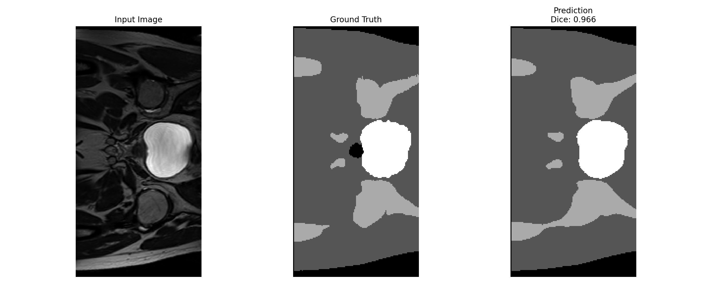
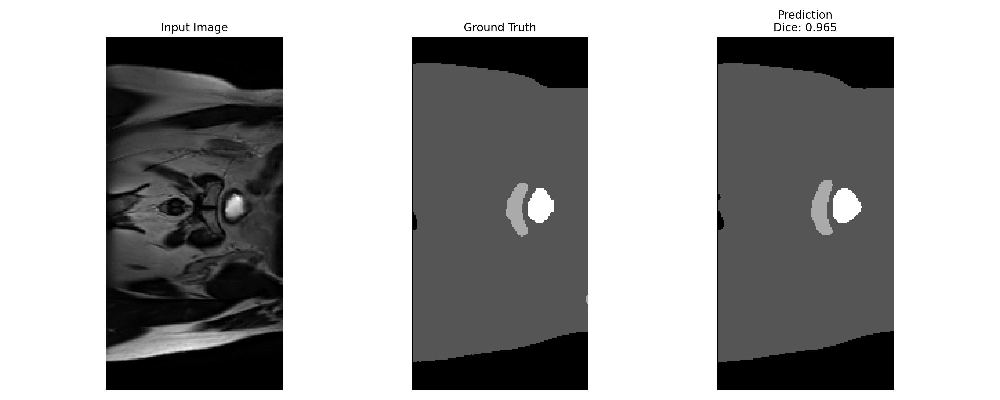
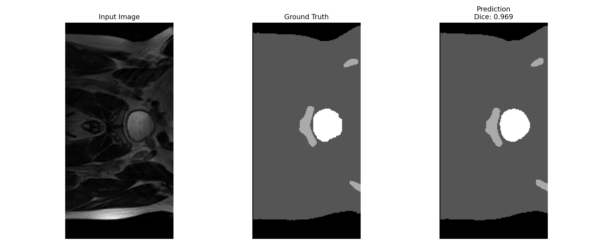
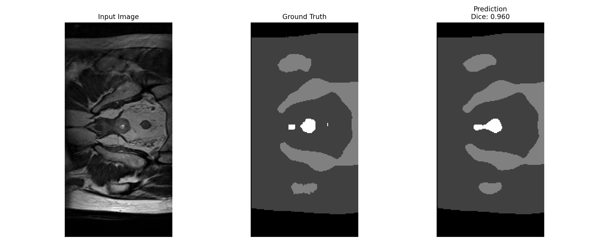

# Prostate cancer segmentation using 2D Improved UNet
Author: Ivan Juin Le Tiang, 46494157

## Description
This project uses a 2D Improved U-Net model to segment prostate regions from MRI scans in the HipMRI study. The goal is to automatically identify and separate the prostate and surrounding tissues from 2D MRI slices, which can assist in prostate cancer diagnosis. The model learns to predict a pixel-wise segmentation mask where each pixel is classified into one of several tissue types. This helps highlight the location and shape of the prostate for further clinical analysis.

## Model Overview
The Improved U-Net is based on the original U-Net architecture but modified for stability and accuracy on small medical datasets.  
It follows an encoder–decoder design with skip connections between corresponding layers to preserve spatial information.  
Each stage uses convolutional layers, instance normalization, and Leaky ReLU activations.

### Key Improvements
- **Instance Normalization:** replaces batch normalization for small-batch robustness  
- **Leaky ReLU (α = 0.01):** prevents dead neurons and smooths gradients  
- **Dropout (p = 0.3):** improves generalization  
- **Nearest-neighbour upsampling + convolution:** avoids checkerboard artifacts  
- **Deep skip connections:** blend low- and high-level features for sharper segmentations  

## Dataset and Preprocessing
The dataset used is the **HipMRI Study on Prostate Cancer**, provided as processed 2D slices on Rangpur.  
Each image is a single axial MRI slice with corresponding label masks stored in NIfTI format (`.nii` or `.nii.gz`).

| Split | Images | Masks | Purpose |
|:--|:--:|:--:|:--|
| Train | 11,460 | 11,460 | Model training |
| Validation | 660 | 660 | Hyperparameter tuning |
| Test | 540 | 540 | Final evaluation |

### Preprocessing Pipeline
1. **Resize:** all slices to 256×128 pixels  
2. **Z-score normalization:** per-slice mean 0, std 1  
3. **One-hot encoding:** segmentation masks into 5 channels (Background, Bladder, Rectum, Prostate, Femur)  
4. **Tensor conversion:** NumPy arrays to PyTorch tensors  
5. **Data split:** 80% training, 10% validation, 10% testing (non-overlapping)

## Training Configuration

| Parameter | Value |
|:--|:--|
| Optimizer | AdamW (lr=1e−4, weight_decay=1e−6) |
| Loss | CrossEntropyLoss |
| Scheduler | ReduceLROnPlateau (factor=0.5, patience=3) |
| Batch size | 8 |
| Epochs | 20 |
| Device | CUDA / MPS / CPU (auto-detected) |
| Metric | Per-class Dice coefficient |

The training process computes Dice scores per class each epoch, saving the model with the highest validation Dice as **`model_final.pth`**.

## Results

### Validation Results (Epoch 15)
| Class | Dice |
|:--|--:|
| Background | 0.987 |
| Bladder | 0.980 |
| Rectum | 0.923 |
| Prostate | 0.821 |
| Femur | 0.865 |
| **Mean Dice** | **0.915** |

### Test Results
| Class | Dice |
|:--|--:|
| Background | 0.9932 |
| Bladder | 0.9837 |
| Rectum | 0.9173 |
| **Prostate** | **0.9350** |
| Femur | 0.8904 |
| **Mean Dice** | **0.9439** |

> While the original Improved U-Net (Isensee et al., 2018) was trained using a **multiclass Dice loss** to handle class imbalance, this implementation uses **CrossEntropyLoss** for stable convergence on 2D slices.

The model exceeds the **requirement (>= 0.75)** on the prostate label with strong overall consistency.

## Training Progress

Training converged smoothly over 20 epochs with both training and validation losses stabilizing after epoch 10, indicating no signs of overfitting. Validation Dice remained consistent around 0.91, confirming strong generalization.

### Training Metrics

  

  

## Qualitative Results
Each figure below shows the input MRI slice (left), ground-truth segmentation (middle), and model prediction (right).  
The predictions visually align with the prostate boundaries and surrounding organs.




 

## Dependencies
```
python >= 3.9
torch >= 2.0
torchvision
nibabel
numpy
matplotlib
tqdm
scikit-image
```

## Usage

**Note:** This project was trained and tested locally on a 2025 MacBook Pro using the CPU and Apple MPS backend.

### Training
```bash
python train.py
```

### Inference
```bash
python predict.py
```

### References
1. F. Isensee, P. Kickingereder, W. Wick, M. Bendszus, and K. H. Maier-Hein, “Brain Tumor Segmentation
and Radiomics Survival Prediction: Contribution to the BRATS 2017 Challenge,” Feb. 2018. [Online].
Available: https://arxiv.org/abs/1802.10508v1